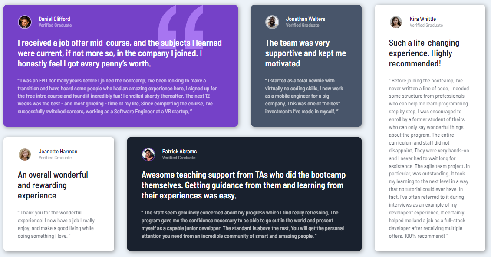

# Frontend Mentor - Testimonials grid section solution

This is a solution to the [Testimonials grid section challenge on Frontend Mentor](https://www.frontendmentor.io/challenges/testimonials-grid-section-Nnw6J7Un7). Frontend Mentor challenges help you improve your coding skills by building realistic projects. 

## Table of contents

- [Overview](#overview)
  - [The challenge](#the-challenge)
  - [Screenshot](#screenshot)
  - [Links](#links)
- [My process](#my-process)
  - [Built with](#built-with)
  - [What I learned](#what-i-learned)
  - [Continued development](#continued-development)
  - [Useful resources](#useful-resources)
- [Author](#author)

## Overview

### The challenge

Users should be able to:

- View the optimal layout for the site depending on their device's screen size

### Screenshot

The standard desktop layout



Mobile Layout


### Links

- Solution URL: [Frontend Mentor](https://www.frontendmentor.io/solutions/testimonials-using-cssgrid-and-scss-kv3lI6jtMQ)
- Live Site URL: [Github Pages](https://timmartin13-frontend-mentor.github.io/testimonials-grid-section/)

## My process

### Built with

- Semantic HTML5 markup
- SCSS
- Flexbox
- CSS Grid
- Mobile-first workflow

### What I learned

Learned how to use CSS-Grid properly. Also started looking into the BEM naming conventions.

My desktop grid:
```css
main {
    display: grid;
    grid-template:
      "card--1 card--1 card--2 card--5" auto
      "card--3 card--4 card--4 card--5" auto
      / 1fr 1fr 1fr 1fr;
    grid-column-gap: 1.875rem;
    grid-row-gap: 1.5rem;
    max-width: 1110px
  }
```

### Continued development

I will continue to use CSS-Grid as it is a very powerful tool for layouts.


### Useful resources

- [CSS_Grid](https://css-tricks.com/snippets/css/complete-guide-grid/) - I really find css-tricks.com to be very helpful for all things CSS.
- [BEM Naming](http://getbem.com/naming/) - This articla got me started on the BEM naming conventions.

## Author

- Website - [My portfolio](https://timmartin13.github.io/react-portfolio/)
- Frontend Mentor - [@TimMartin13](https://www.frontendmentor.io/profile/TimMartin13)